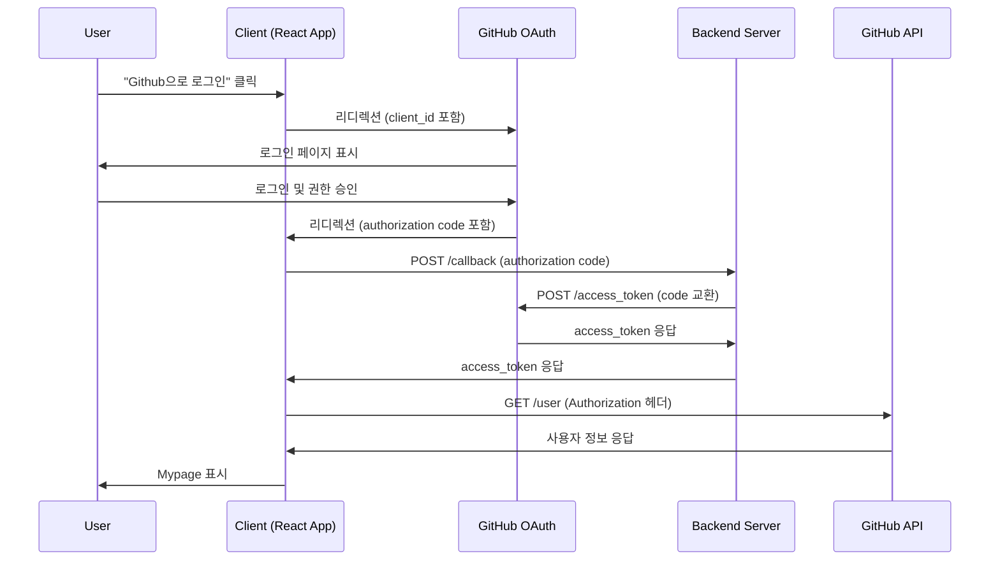

# 디자인 문서

## 개요

이 문서는 Bitrend 애플리케이션에 GitHub OAuth 2.0 인증 기능을 구현하기 위한 상세 설계를 정의합니다. React와 TypeScript를 사용하여 프론트엔드를 구현하며, OAuth 2.0 Authorization Code Flow를 따릅니다.

## 아키텍처

### 인증 플로우



### 컴포넌트 구조

```
App (인증 상태 관리)
├── Login (비인증 상태)
│   └── GitHub 로그인 버튼
└── Mypage (인증 상태)
    └── 사용자 정보 표시
```

## 컴포넌트 및 인터페이스

### 1. App 컴포넌트

**책임:**
- 전역 인증 상태 관리 (isLogin, accessToken)
- URL에서 authorization code 추출
- 토큰 교환 프로세스 조율
- 인증 상태에 따른 컴포넌트 렌더링

**상태 인터페이스:**
```typescript
interface AuthState {
  isLogin: boolean;
  accessToken: string;
}
```

**주요 메서드:**
- `useEffect`: 컴포넌트 마운트 시 URL에서 authorization code 확인
- `getAccessToken(authorizationCode: string)`: Backend Server에 토큰 요청
- 라우팅 로직: isLogin 상태에 따라 Login 또는 기존 페이지 표시

### 2. Login 컴포넌트

**책임:**
- GitHub 로그인 버튼 렌더링
- GitHub OAuth 페이지로 리디렉션

**Props:**
```typescript
interface LoginProps {
  // Props 없음 (독립적으로 동작)
}
```

**주요 메서드:**
- `socialLoginHandler()`: GitHub OAuth URL로 리디렉션

**상수:**
```typescript
const GITHUB_LOGIN_URL = 'https://github.com/login/oauth/authorize?client_id=ee33270fac53d2e7b61c';
```

### 3. Mypage 컴포넌트

**책임:**
- GitHub 사용자 정보 조회
- 사용자 정보 표시 (name, login, html_url, public_repos)

**Props:**
```typescript
interface MypageProps {
  accessToken: string;
}
```

**상태 인터페이스:**
```typescript
interface GitHubUserInfo {
  name: string;
  login: string;
  html_url: string;
  public_repos: number;
}
```

**주요 메서드:**
- `useEffect`: 컴포넌트 마운트 시 사용자 정보 조회
- `getGitHubUserInfo()`: GitHub API에서 사용자 정보 가져오기

## 데이터 모델

### Authorization Code 교환 요청

**엔드포인트:** `POST http://localhost:3000/callback`

**요청 본문:**
```typescript
interface TokenRequest {
  authorizationCode: string;
}
```

**응답:**
```typescript
interface TokenResponse {
  accessToken: string;
}
```

### GitHub 사용자 정보 조회

**엔드포인트:** `GET https://api.github.com/user`

**요청 헤더:**
```typescript
{
  Authorization: `token ${accessToken}`
}
```

**응답:**
```typescript
interface GitHubUser {
  name: string;
  login: string;
  html_url: string;
  public_repos: number;
  // GitHub API는 더 많은 필드를 반환하지만, 위 4개만 사용
}
```

## 오류 처리

### 1. Authorization Code 추출 실패
- **시나리오:** URL에 code 파라미터가 없음
- **처리:** Login 컴포넌트 표시 (정상 플로우)

### 2. 토큰 교환 실패
- **시나리오:** Backend Server가 에러 응답 또는 네트워크 오류
- **처리:** 
  - axios catch 블록에서 에러 캐치
  - 로그인 상태를 false로 유지
  - Login 컴포넌트 계속 표시
  - 콘솔에 에러 로그 (선택적)

### 3. 사용자 정보 조회 실패
- **시나리오:** GitHub API 요청 실패 (잘못된 토큰, 네트워크 오류 등)
- **처리:**
  - 에러 상태 표시 또는 기본값 표시
  - 애플리케이션 크래시 방지
  - 사용자에게 재시도 옵션 제공 (선택적)

### 4. 네트워크 오류
- **시나리오:** 인터넷 연결 끊김
- **처리:**
  - axios의 기본 에러 처리 활용
  - 사용자 친화적인 에러 메시지 표시

## 테스트 전략

### 단위 테스트

1. **Login 컴포넌트**
   - GitHub 로그인 버튼 렌더링 확인
   - 버튼 클릭 시 올바른 URL로 리디렉션 확인

2. **Mypage 컴포넌트**
   - accessToken prop 전달 확인
   - 사용자 정보 표시 확인
   - API 호출 시 올바른 헤더 포함 확인

3. **App 컴포넌트**
   - URL에서 authorization code 추출 로직
   - 토큰 교환 API 호출 확인
   - 인증 상태에 따른 조건부 렌더링

### 통합 테스트

1. **전체 인증 플로우**
   - Login → GitHub 리디렉션 → Callback → Mypage 표시
   - Mock Backend Server 사용

2. **에러 시나리오**
   - 잘못된 authorization code
   - 네트워크 오류
   - 잘못된 access token

### E2E 테스트 (선택적)

1. 실제 GitHub OAuth 플로우 테스트
2. 사용자 정보 표시 확인

## 구현 세부사항

### 기술 스택
- **프레임워크:** React 19.1.1
- **언어:** TypeScript 5.8.3
- **라우팅:** React Router DOM 7.9.6
- **HTTP 클라이언트:** axios (추가 필요)
- **스타일링:** Emotion (@emotion/react, @emotion/styled)

### 스타일링 가이드라인
- 기존 Theme 시스템 활용 (src/Theme/theme.ts)
- Login 페이지: 중앙 정렬, 카드 형태
- GitHub 로그인 버튼: Primary 색상 (HotPink_10) 사용
- Mypage: 기존 User 페이지 스타일과 일관성 유지

### 보안 고려사항

1. **Access Token 저장**
   - 현재 설계: React state (메모리)
   - 장점: XSS 공격에 상대적으로 안전
   - 단점: 페이지 새로고침 시 로그인 상태 유실
   - 향후 개선: localStorage 또는 httpOnly 쿠키 고려

2. **HTTPS 사용**
   - 프로덕션 환경에서 HTTPS 필수
   - 개발 환경: localhost는 안전한 컨텍스트로 간주됨

3. **Client Secret 보호**
   - Client Secret은 절대 프론트엔드에 노출하지 않음
   - Backend Server에서만 사용

4. **CORS 설정**
   - Backend Server에서 적절한 CORS 헤더 설정 필요

### 의존성 추가

프로젝트에 axios 추가 필요:
```bash
npm install axios
```

### 환경 변수 (선택적)

향후 확장성을 위해 환경 변수 사용 권장:
```typescript
const GITHUB_CLIENT_ID = import.meta.env.VITE_GITHUB_CLIENT_ID;
const BACKEND_URL = import.meta.env.VITE_BACKEND_URL;
```

## 향후 개선 사항

1. **로그아웃 기능**
   - 로그아웃 버튼 추가
   - 인증 상태 초기화

2. **토큰 갱신**
   - Refresh token 구현
   - Access token 만료 처리

3. **로딩 상태**
   - API 호출 중 로딩 인디케이터 표시

4. **에러 UI**
   - 사용자 친화적인 에러 메시지
   - 재시도 버튼

5. **인증 상태 지속성**
   - localStorage 또는 sessionStorage 활용
   - 페이지 새로고침 후에도 로그인 유지

6. **Protected Routes**
   - 인증이 필요한 페이지 보호
   - 비인증 사용자 자동 리디렉션
